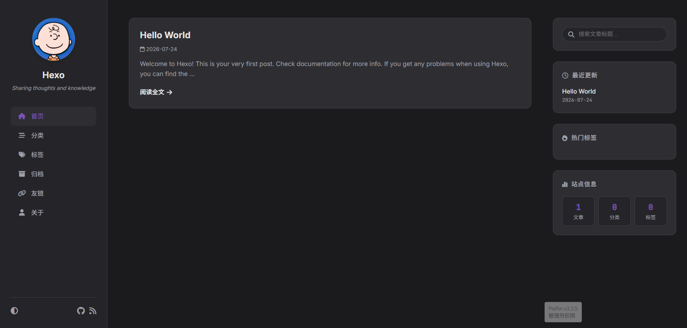

<div align="center">

# 🚀 Hexo Theme Chirpy Classic `v2.1`

> 简约、高颜值且功能丰富的 Hexo 极简技术博客主题。采用 **Zero-CLI 零配置开箱即用架构**，内置 **Hexo Theme Schema 协议** 与 **67 种 Awesome Design Skills 视觉预设库**，支持 Hexo CMS 可视化配置、智能日夜间模式适配、Mermaid 架构绘图、TOC 目录及无损全卡片交互。

[](https://github.com/base404/hexo-theme-chirpy/releases/tag/v2.1)
[](https://hexo.io/)
[](https://github.com/bergside/awesome-design-skills)
[](#-zero-cli-零配置开箱即用)
[](./LICENSE)

<br />



</div>

---

> [!NOTE]
> **🎨 设计致谢与借鉴声明 (Credits & Inspiration)**  
> 本主题的整体版式排版、视觉美学风格与 HSL 配色方案深度借鉴汲取自 **[AirboZH / halo-theme-chirpy](https://github.com/airbozh/halo-theme-chirpy)**。在此对原作者 [AirboZH](https://www.airbozh.cn/) 为前端开源社区贡献的优秀排版设计致以诚挚的感谢！  
> 同时感谢 **[bergside / awesome-design-skills](https://github.com/bergside/awesome-design-skills)** 为本主题提供丰富全面的 67 种 Design System 预设与 Agent Skills。

---

## 🌟 核心特性 (Features)

- 🎨 **全量内置 67 种 Awesome Design System 视觉预设**
  - 完美集成 [awesome-design-skills](https://github.com/bergside/awesome-design-skills) 注册库包含的所有 67 种设计系统风格（如 `Bento`, `Brutalism`, `Claymorphism`, `Glassmorphism`, `Material Design`, `Matrix`, `Neobrutalism`, `Neon`, `Paper`, `Retro`, `Shadcn`, `Vintage` 等）；
  - 支持在 `_config.yml` 中设置 `style_preset: "bento"`，或在 [Hexo CMS](https://github.com/base404/hexo-cms) 可视化编辑器中一键无缝切换！
- 🤖 **内置 Agentic Skills 系统 (`.agents/skills/`)**
  - 项目自带 `.agents/skills/` 目录，全量内置 67 种 Design System Skill 规则与 Design Guideline。AI Coding Agent（如 Antigravity, Claude Code, Cursor）在开发时可直接自动读取并遵从该设计规范。
- 🌓 **智能日夜间模式与单模隐藏保护 (Dark / Light Mode)**
  - 通用预设（如 `Bento`, `Nordic`, `Shadcn`, `Clean` 等）支持智能日夜间深浅模式自动映射与平滑过渡；
  - 针对固定暗黑系风格（如 `Matrix`, `Cyberpunk`, `Neon`, `Cosmic` 等），智能自动隐藏模式切换按钮，保持纯粹沉浸式体验。
- ⚡ **Zero-CLI 零配置开箱即用 (`v2.0+`)**
  - **自动 Mermaid 排除**：无需修改根目录 `_config.yml`，主题自动处理代码高亮转义；
  - **自动虚拟路由生成**：无需运行 `hexo new page` 手动新建 Markdown 页面，`/categories/`, `/tags/`, `/about/`, `/links/` 开箱即用。
- 🎛️ **Hexo Theme Schema 标准驱动**
  - 无缝兼容 [Hexo CMS](https://github.com/base404/hexo-cms) 可视化编辑器；
  - 动态可视化配置个人资料、技能胶囊标签（Tag Pills）与友情链接卡片。
- 📊 **Mermaid.js 架构绘图增强**
  - 内置流程图、时序图、甘特图等动态渲染，支持放大、缩小、复位与全屏全屏浏览。
- 📖 **极致阅读沉浸体验**
  - 右侧悬浮层次化 TOC 目录（随滚动实时高亮当前标题）；
  - 顶栏动态阅读进度条与代码块一键快捷复制；
  - 首页无损全卡片点击区域跳转；
  - 支持 Waline / Giscus / Disqus 无缝嵌入。

---

## 🚀 快速开始 (Quick Start)

### 📋 开发与运行环境 (Environment)

本主题在以下环境中经过完整测试与开发：

- **Node.js**: `v24.16.0` (推荐 `>= 18.0.0`)
- **npm**: `v12.0.1` (推荐 `>= 9.0.0`)
- **Hexo**: `>= 5.0.0` (推荐 Hexo 7.x)

### 1. 下载主题

进入 Hexo 博客根目录的 `themes/` 文件夹中克隆本仓库：

```bash
cd themes
git clone https://github.com/base404/hexo-theme-chirpy.git chirpy
```

### 2. 启用主题与设置风格预设

修改 Hexo 博客根目录下的 `_config.yml`：

```yaml
theme: chirpy
style_preset: "bento" # 可选: bento, matrix, brutalism, glassmorphism, paper, shadcn 等 67 种预设
```

### 3. 运行体验

启动 Hexo 本地服务或通过 Hexo CMS 一键开启预览：

```bash
npx hexo s
```

> **🎉 完成！** 得益于 v2.0 的 Zero-CLI 机制，无需进行任何其他手动设置，所有页面与绘图均可直接访问呈现。

---

## 🎛️ 可视化配置与 Schema (Configuration)

在 [Hexo CMS](https://github.com/base404/hexo-cms) 后台中：
1. 打开 **“主题市场 (Theme Market)”** 页面；
2. 在 **Chirpy Classic** 主题卡片上点击 **【配置 Schema】** 按钮；
3. 您可以在可视化面板中进行如下实时配置：
   - 从 67 种预设风格中快速选择与预览；
   - 个人头像 URL 与关于页介绍；
   - 技能胶囊标签 (`about.skills`) 增删；
   - 友情链接卡片 (`friends`) 增删与编辑；
   - 评论区开关。

所有修改将自动持久化保存至 `_config.chirpy.yml`。

---

## 📜 开源许可与致谢 (License & Credits)

- **Layout & Design Credit**: Inspired by [halo-theme-chirpy](https://github.com/airbozh/halo-theme-chirpy) created by [AirboZH](https://github.com/airbozh).
- **Design System Skills Credit**: Integrated from [awesome-design-skills](https://github.com/bergside/awesome-design-skills) created by [bergside](https://github.com/bergside).
- **License**: Released under the [MIT License](./LICENSE).
