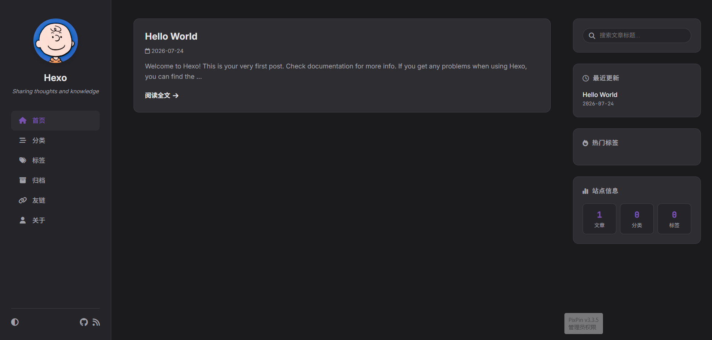

<div align="center">

  <br />
  <div style="background: linear-gradient(135deg, #18181b 0%, #27272a 100%); width: 88px; height: 88px; border-radius: 20px; display: inline-flex; align-items: center; justify-content: center; box-shadow: 0 16px 36px rgba(0,0,0,0.3), 0 0 0 1px rgba(255,255,255,0.1);">
    <h1 style="color: #a855f7; font-size: 44px; margin: 0; padding: 0; line-height: 1;">⚡</h1>
  </div>

  <h1 align="center" style="font-size: 2.25rem; font-weight: 800; letter-spacing: -0.025em; margin-top: 16px; margin-bottom: 8px;">Hexo Theme Chirpy Classic</h1>

  <p align="center">
    <b>简约、高颜值且功能丰富的 Hexo 极简技术博客主题</b>
    <br />
    <sub><i>Zero-CLI Out-of-the-Box Architecture with 67 Awesome Design Skills Presets, Multi-Language Schema & Interactive Mermaid Scaling</i></sub>
  </p>

  <p align="center">
    <a href="https://github.com/base404/hexo-theme-chirpy/releases"></a>
    <a href="https://hexo.io/"></a>
    <a href="https://github.com/bergside/awesome-design-skills"></a>
    <a href="https://github.com/base404/hexo-cms"></a>
    <a href="./LICENSE"></a>
  </p>

  <br />

  

  <br /><br />

  <p align="center">
    <a href="#-功能列表-features-list"><b>功能列表</b></a> &nbsp;•&nbsp;
    <a href="#-快速开始-quick-start"><b>快速开始</b></a> &nbsp;•&nbsp;
    <a href="#-可视化配置与多语言-schema-i18n"><b>Schema 多语言</b></a> &nbsp;•&nbsp;
    <a href="#-目录结构-directory-structure"><b>目录结构</b></a> &nbsp;•&nbsp;
    <a href="#-开源许可与致谢-credits"><b>开源致谢</b></a>
  </p>

  <br />

</div>

---

> [!NOTE]
> **🎨 设计致谢与借鉴声明 (Credits & Inspiration)**  
> 本主题的整体版式排版、视觉美学风格与 HSL 配色方案深度借鉴汲取自 **[AirboZH / halo-theme-chirpy](https://github.com/airbozh/halo-theme-chirpy)**。在此对原作者 [AirboZH](https://www.airbozh.cn/) 为前端开源社区贡献的优秀排版设计致以诚挚的感谢！  
> 同时感谢 **[bergside / awesome-design-skills](https://github.com/bergside/awesome-design-skills)** 为本主题提供丰富全面的 67 种 Design System 预设与 Agent Skills。

---

## ✨ 功能列表 (Features List)

- 🎨 **67 种 Awesome Design System 视觉预设库**
  - 全量内置 [awesome-design-skills](https://github.com/bergside/awesome-design-skills) 注册库包含的 67 种设计系统风格（包含 `bento`, `brutalism`, `claymorphism`, `glassmorphism`, `material`, `matrix`, `neon`, `paper`, `shadcn`, `vintage` 等）；
  - 支持在 `_config.yml` 中设置 `style_preset: "bento"`，或在 [Hexo CMS](https://github.com/base404/hexo-cms) 可视化编辑器中一键即时无缝预览与切换。
- 🤖 **内置 Agentic Skills 系统 (`.agents/skills/`)**
  - 项目自带 `.agents/skills/` 规范目录，全量内置 67 种 Design System Skill 规则。AI 编程助手（如 Antigravity, Claude Code, Cursor）在开发时可直接自动读取并遵从该设计规范。
- 🔍 **全站标题 JSON 内存级搜索 (Search Scheme A)**
  - 静态编译期通过脚本自动输出轻量 `search.json` 索引，支持在右侧栏实时输入关键字，快速弹出全站文章标题下拉匹配卡片；
  - 采用仅匹配标题与去除正文 DOM 属性策略，显著降低静态 HTML 文件体积，提升首屏加载性能。
- 📊 **交互式 Mermaid 图表 & 全屏拖拽平移/滚轮缩放**
  - 完美渲染 Mermaid.js 流程图、时序图与架构图；
  - 点击流程图展开全屏 Modal 视图，支持鼠标按住自由拖拽平移（Drag & Pan）以及 `0.2x ~ 5.0x` 鼠标滚轮无级自由缩放，配备放大、缩小、100% 快捷复位与 Esc 关闭工具栏。
- 🌓 **18:00 ~ 06:00 时间段智能日夜间模式**
  - Head 内联防闪烁脚本在 DOM 渲染前判定用户偏好与当地时间（18:00 至次日早 06:00 自动开启夜间暗黑模式）；
  - 全站色彩变量深度映射，评论区（Waline 暗黑模式）与文章正文色彩 100% 自动同步。
- 🎛️ **Hexo Theme Schema 协议与多语言 (i18n)**
  - 提供 `theme-schema.yaml` (English) 与 `theme-schema_汉语.yaml` (汉语) 双语架构定义文件；
  - 无缝兼容 [Hexo CMS](https://github.com/base404/hexo-cms) 可视化编辑器，支持在 CMS 弹窗右上角动态切换界面语言。
- 📖 **文章底部【上一篇 / 下一篇】导航卡片**
  - 文章页正文下方自动静态生成上一篇与下一篇文章导航卡片；
  - 具备悬浮微动画与边框高亮，响应式适配移动端与桌面端。
- 📖 **排版间距美化 (Typography & Spacing)**
  - 优化段落 `1.8` 行高与段后距，优雅美化 `h1`~`h6` 标题层次边距、炫彩边框引言块 (`blockquote`)、代码块一键快捷复制、表格与 TOC 滚动实影高亮。
- ⚡ **Zero-CLI 零配置开箱即用 (`v2.0+`)**
  - 自动处理代码高亮转义，无需手动操作；
  - 自动路由生成：无需运行 `hexo new page` 手动新建文件，`/categories/`, `/tags/`, `/about/`, `/links/` 开箱即用。
- 💬 **主流评论系统无缝集成**
  - 原生支持 Waline、Giscus (GitHub Discussions) 与 Disqus 评论系统。

<br />

## 🚀 快速开始 (Quick Start)

### 📋 开发与运行环境 (Prerequisites)

| 环境 / 工具 | 开发测试验证版本 | 推荐要求 |
| :--- | :--- | :--- |
| 🟢 **Node.js** | `v24.16.0` | `>= 18.0.0` (LTS) |
| 📦 **npm** | `v12.0.1` | `>= 9.0.0` |
| 💻 **操作系统 (OS)** | `Windows 11 (x64)` | Windows / macOS / Linux |
| 🔧 **Git** | `v2.55.0` | `>= 2.20.0` |
| ⚡ **Hexo** | `>= 5.0.0` | 推荐 `Hexo 7.x` |

<br />

### 1. 安装主题

进入 Hexo 博客根目录的 `themes/` 文件夹中克隆本仓库：

```bash
cd themes
git clone https://github.com/base404/hexo-theme-chirpy.git chirpy
```

### 2. 启用主题与预设

修改 Hexo 博客根目录下的 `_config.yml`：

```yaml
theme: chirpy
style_preset: "bento" # 可选: bento, matrix, brutalism, glassmorphism, paper, shadcn 等 67 种预设
```

### 3. 本地运行

启动 Hexo 服务或通过 Hexo CMS 可视化一键预览：

```bash
npx hexo s
```

> **🎉 开箱即用！** 得益于 Zero-CLI 零配置架构，无需运行额外的页面生成指令，分类、标签、关于、友链及 Mermaid 绘图直接渲染使用。

<br />

## 🎛️ 可视化配置与多语言 Schema (Schema i18n)

在 [Hexo CMS](https://github.com/base404/hexo-cms) 管理后台中：

1. 进入 **“主题市场 (Theme Market)”** 选项卡；
2. 点击 **Chirpy Classic** 主题卡片上的 **【配置】** 按钮；
3. 在弹窗右上角下拉框中可动态切换 **`[ 汉语 ]`** 或 **`[ English (Default) ]`** 界面语言；
4. 轻松完成以下配置：
   - 从 67 种预设风格中可视化选择；
   - 技能胶囊标签 (`about.skills`) 动态增删；
   - 友情链接卡片 (`friends`) 对象动态增删与编辑；
   - 评论系统参数（Waline / Giscus / Disqus）与每页文章分页数 (`pagination.per_page`)。

<br />

## 📁 目录结构 (Directory Structure)

```text
hexo-theme-chirpy/
├── .agents/skills/           # 67 种 Design System 预设与 AI Skills 规则
├── layout/                   # EJS 模板 (index, post, page, archive, category, tag, _partial)
├── scripts/                  # Hexo 插件脚本
│   ├── chirpy_auto_init.js   # 零配置自动路由与全局过滤
│   ├── search_generator.js   # 全站标题 JSON 搜索索引生成器
│   └── pagination_config.js  # 动态分页配置拦截注入器
├── source/
│   ├── css/main.css          # 主排版与 67 种预设 CSS 变量系统
│   └── js/main.js            # 昼夜模式、Mermaid 拖拽平移/滚轮缩放、JSON 下拉搜索
├── theme-schema.yaml         # English 默认可视化 Schema 配置文件
├── theme-schema_汉语.yaml     # 汉语可视化 Schema 配置文件
├── _config.yml               # 主题默认配置文件 (默认全英文规范)
├── screenshot.png            # 主题全景预览截图
└── README.md                 # 项目说明
```

<br />

## 📜 开源许可与致谢 (License & Credits)

- **Layout & Design Credit**: Inspired by [halo-theme-chirpy](https://github.com/airbozh/halo-theme-chirpy) created by [AirboZH](https://github.com/airbozh).
- **Design System Skills Credit**: Integrated from [awesome-design-skills](https://github.com/bergside/awesome-design-skills) created by [bergside](https://github.com/bergside).
- **License**: Released under the [MIT License](./LICENSE).
